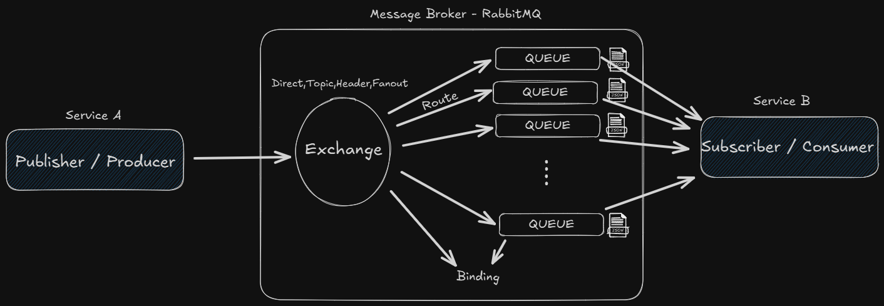

 # What is RabbitMQ?
RabbitMQ is an open-source message broker software that facilitates communication between different applications or services by sending and receiving messages. It implements the Advanced Message Queuing Protocol (AMQP) and provides a reliable way to manage and route messages in distributed systems. RabbitMQ is widely used in microservices architectures, event-driven systems, and other scenarios where decoupled communication is essential. It supports various messaging patterns, including point-to-point, publish-subscribe, and request-response, making it a versatile choice for building scalable and resilient applications. 

## Key Features of RabbitMQ:
1. **Message Queuing**: RabbitMQ allows applications to send messages to queues, where they can be stored until they are processed by consumers.
2. **Reliability**: It provides features like message acknowledgments, persistent messages, and durable queues to ensure that messages are not lost in case of failures.
3. **Flexible Routing**: RabbitMQ supports various exchange types (direct, topic, fanout, headers) to route messages based on different criteria.
4. **Clustering and High Availability**: RabbitMQ can be deployed in a clustered setup to ensure high availability and load balancing.
5. **Plugins and Extensions**: RabbitMQ has a rich ecosystem of plugins that extend its functionality, including support for different protocols, monitoring tools, and management interfaces.
6. **Multi-language Support**: RabbitMQ has client libraries for various programming languages, making it accessible to developers using different tech stacks.
7. **Management Interface**: RabbitMQ provides a web-based management interface for monitoring and managing the broker, queues, exchanges, and bindings.
## Use Cases of RabbitMQ:
- **Microservices Communication**: RabbitMQ is commonly used to facilitate communication between microservices in a decoupled manner.
- **Task Queues**: It is used to distribute tasks among worker processes for parallel processing.
- **Event-Driven Architectures**: RabbitMQ enables event-driven systems by allowing services to publish and subscribe to events.
- **Data Streaming**: It can be used for real-time data streaming and processing applications.

## Components of RabbitMQ:
- **Producer/Publisher**: An application that sends messages to RabbitMQ.
- **Consumer/Subscriber**: An application that receives messages from RabbitMQ.
- **Queue**: A buffer that stores messages until they are processed by consumers.
- **Exchange**: A component that routes messages to queues based on defined rules.
- **Binding**: A link between an exchange and a queue that defines how messages are routed
- **Channel**: A virtual connection within a TCP connection that allows multiple streams of communication.
- **Virtual Host (vhost)**: A namespace for queues, exchanges, and bindings that allows for multi-tenancy within a single RabbitMQ instance.
- **Connection**: A TCP connection between the client and the RabbitMQ server.
- **Message**: The data that is sent between producers and consumers via RabbitMQ.



## Exchange Types:
1. **Direct Exchange**: Routes messages to queues based on an exact match between the routing key and the queue binding key.
2. **Topic Exchange**: Routes messages to queues based on pattern matching between the routing key and the queue binding key, allowing for more flexible routing. # means match one word, and * means match zero or more words.
3. **Fanout Exchange**: Routes messages to all bound queues, regardless of the routing key. It is used for broadcasting messages to multiple consumers.
4. **Headers Exchange**: Routes messages based on message header attributes instead of the routing key. x_match is used to define the matching criteria. priority can be set to define the importance of the message. type can be used to categorize messages.

## RabbitMQ with Docker:
You can easily run RabbitMQ using Docker. Here is a simple command to start a RabbitMQ container:

```bash
docker run -d --name rabbitmq -p 5672:5672 -p 15672:15672 rabbitmq:3-management
```